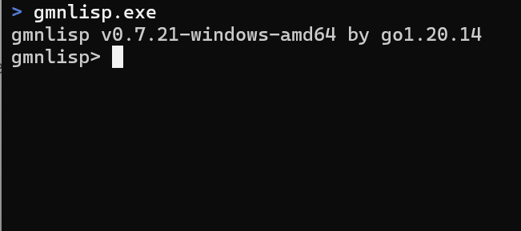

Gmnlisp
=======

[](https://pkg.go.dev/github.com/hymkor/gmnlisp)
[](https://github.com/hymkor/gmnlisp/actions/workflows/go.yml)

Gmnlisp is the interpreter of [ISLisp] written in Go.
It is developed to embbed to the applications for customizing.



Usage and Integration Guide
----------------------------

```examples/example.go
package main

import (
    "context"
    "fmt"
    "os"

    "github.com/hymkor/gmnlisp"
)

func sum(ctx context.Context, w *gmnlisp.World, args []gmnlisp.Node) (gmnlisp.Node, error) {
    a, err := gmnlisp.ExpectClass[gmnlisp.Integer](ctx, w, args[0])
    if err != nil {
        return nil, err
    }
    b, err := gmnlisp.ExpectClass[gmnlisp.Integer](ctx, w, args[1])
    if err != nil {
        return nil, err
    }
    return a + b, nil
}

func main() {
    lisp := gmnlisp.New()

    lisp = lisp.Let(gmnlisp.Variables{
        gmnlisp.NewSymbol("a"): gmnlisp.Integer(1),
        gmnlisp.NewSymbol("b"): gmnlisp.Integer(2),
    })

    lisp = lisp.Flet(
        gmnlisp.Functions{
            gmnlisp.NewSymbol("sum"): &gmnlisp.Function{C: 2, F: sum},
        })

    value, err := lisp.Interpret(context.TODO(), "(sum a b)")
    if err != nil {
        fmt.Fprintln(os.Stderr, err.Error())
        return
    }
    fmt.Println(value.String())
}
```

```
$ go run examples/example.go
3
```

- `gmnlisp.New` returns a new Lisp interpreter instance (`*gmnlisp.World`).
- `gmnlisp.NewSymbol` constructs a symbol. Calling `gmnlisp.NewSymbol("a")` always returns the same value, no matter how many times it's called.
- `gmnlisp.Variables` is a symbol map type. It is an alias for `map[gmnlisp.Symbol]gmnlisp.Node`.  
  `Node` is the interface that all Lisp objects must implement.
- `.Let` creates a new world instance with the given variable bindings (namespace).

```lisp
lisp.Let(gmnlisp.Variables{
    gmnlisp.NewSymbol("a"): gmnlisp.Integer(1),
    gmnlisp.NewSymbol("b"): gmnlisp.Integer(2),
}).Interpret(context.Background(), "(c)")

```

is equivalent to the Lisp code: `(let ((a 1) (b 2)) (c))`

### Type assertions

`a, err := gmnlisp.ExpectClass[gmnlisp.Integer](ctx, w, x)`  
is similar to:  
`a, ok := x.(gmnlisp.Integer)`  

However, `ExpectClass` invokes the user-defined error handler if `x` is not of type `Integer`.

### User-defined functions

You can register user-defined functions to the interpreter using `.Flet()`:

```go
lisp = lisp.Flet(
    gmnlisp.Functions{
        gmnlisp.NewSymbol("sum"): &gmnlisp.Function{C: 2, F: sum},
    })
```

The function definitions are passed as a `gmnlisp.Functions` map, where the keys are symbols and the values are Lisp function objects. There are several ways to define the function values:

* `gmnlisp.Function1(f)`
  For a function `f` with the signature:
  `func(context.Context, *gmnlisp.World, gmnlisp.Node) (gmnlisp.Node, error)`
  Accepts **one evaluated argument**.

* `gmnlisp.Function2(f)`
  For a function `f` with the signature:
  `func(context.Context, *gmnlisp.World, gmnlisp.Node, gmnlisp.Node) (gmnlisp.Node, error)`
  Accepts **two evaluated arguments**.

* `&gmnlisp.Function{ C: n, Min: min, Max: max, F: f }`
  For a function `f` with the signature:
  `func(context.Context, *gmnlisp.World, []gmnlisp.Node) (gmnlisp.Node, error)`
  Accepts **multiple evaluated arguments**.

  * If `C` is non-zero, the function strictly expects `C` arguments.
  * If `Min` and `Max` are specified instead, the function accepts a range of arguments.
  * If all are left as zero values, argument count is not validated.

  **Note**: A zero value (0) means "unspecified"; negative values are not used.

* `gmnlisp.SpecialF(f)`
  For defining **special forms** (macros, control structures, etc.), where arguments are passed **unevaluated**:
  `func(context.Context, *gmnlisp.World, gmnlisp.Node) (gmnlisp.Node, error)`
  All arguments are passed as a Lisp list (e.g., `(list a b c)` becomes `&gmnlisp.Cons{Car: ..., Cdr: ...}`).

  Inside this function, you can evaluate an argument manually with:

  ```go
  result, err := w.Eval(ctx, x)
  ```

See the example in the "Usage and Integration Guide" section above for how to define and register a user function.

### Supported Types

Lisp values correspond to the following Go types or constructors when embedding gmnlisp in Go applications:

| Lisp         | Go                                      |
---------------|-----------------------------------------|
| `t`          | `gmnlisp.True`                          |
| `nil`        | `gmnlisp.Null`                          |
| `1`          | `gmnlisp.Integer(1)`                    |
| `2.3`        | `gmnlisp.Float(2.3)`                    |
| `"string"`   | `gmnlisp.String("string")`              |
| `Symbol`     | `gmnlisp.NewSymbol("Symbol")`           |
| `(cons 1 2)` | `&gmnlisp.Cons{ Car:gmnlisp.Integer(1), Cdr:gmnlisp.Integer(2) }` |
| `#\A`        | `gmnlisp.Rune('A')`                     |

Unlike other types shown above, `gmnlisp.NewSymbol(...)` is a function call, not a type conversion.
It returns a value of type `Symbol` (defined as `type Symbol int`), which is distinct from `int`.
The function guarantees that the same string always maps to the same symbol value.

`gmnlisp.Node` is the root interface.
All values that appear in Lisp code must implement this interface.

```go
type Node interface {
    Equals(Node, EqlMode) bool
    String() string
    ClassOf() Class
}

type Class interface {
    Node
    Name() Symbol
    InstanceP(Node) bool
    Create() Node
    InheritP(Class) bool
}

type EqlMode int

const (
    STRICT EqlMode = iota // corresponds to (eql a b)
    EQUAL                 // corresponds to (equal a b)
    EQUALP                // corresponds to (equalp a b) 
)
```

ISLisp Compatibility
--------------------

Gmnlisp has been tested with the [ISLisp Verification System](https://islisp.org/verification.html),  
which checks compliance with the ISO ISLisp standard.

| Item      | Result     |
| --------- | ---------- |
| Version   | v0.7.21    |
| Passed    | 15853      |
| Failed    | 558        |
| Pass rate | **96.60%** |

Projects Using gmnlisp
-----------------------

The following open-source applications embed gmnlisp to provide ISLisp-based customization and scripting:

- [**lispect**](https://github.com/hymkor/lispect):  
  A text-terminal automation tool similar to `expect(1)`, powered by a subset of ISLisp.

- [**smake**](https://github.com/hymkor/smake):  
  A build automation tool where Makefiles are written in S-expressions.

References
----------

### Documents (English)

+ [ISLISP - Wikipedia](https://en.wikipedia.org/wiki/ISLISP)
+ [ISLisp Home Page][ISLisp]
+ [www.islisp.info: Home](http://www.islisp.info/)
+ [Programming Language ISLISP Working Draft 23.0](https://nenbutsu.github.io/ISLispHyperDraft/islisp-v23.html)

### Documents (Japanese)

+ [JISX3012:1998 プログラム言語ＩＳＬＩＳＰ](https://kikakurui.com/x3/X3012-1998-01.html)
+ [M.Hiroi's Home Page / お気楽 ISLisp プログラミング超入門](http://www.nct9.ne.jp/m_hiroi/clisp/islisp.html)

### Gmnlisp and other implementations of [ISLisp]

| Implementation      | Language      |  Windows  | Linux     | Execution Model      |
|---------------------|---------------|-----------|-----------|----------------------|
| [OK!ISLisp][oki]    | C             | Supported | Supported | Interpreter/Bytecode compiler |
| [iris]              | Go/JavaScript | Supported | Supported | Interpreter          |
| [Easy-ISLisp][eisl] | C             |           | Supported | Interpreter/Native Compiler |
| **gmnlisp**         | Go            | Supported | Supported | Interpreter          |

[ISLisp]: http://islisp.org/
[oki]: http://islisp.org/OKIISLisp.html
[iris]: https://github.com/islisp-dev/iris
[eisl]: https://github.com/sasagawa888/eisl

Author
------

[hymkor (HAYAMA Kaoru)](https://github.com/hymkor)

License
-------

[MIT Licence](./LICENSE)
