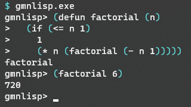

[](https://godoc.org/github.com/hymkor/gmnlisp)

gmnlisp
=======

Gmnlisp is a small Lisp implementation in Go.
( Now under constructing. Experimental implementing )



```go
package main

import (
    "context"
    "fmt"
    "os"

    "github.com/hymkor/gmnlisp"
)

func main() {
    lisp := gmnlisp.New()
    lisp = lisp.Let(gmnlisp.Variables{
        gmnlisp.NewSymbol("a"): gmnlisp.Integer(1),
        gmnlisp.NewSymbol("b"): gmnlisp.Integer(2),
    })
    value, err := lisp.Interpret(context.TODO(), "(+ a b)")
    if err != nil {
        fmt.Fprintln(os.Stderr, err.Error())
        return
    }
    value.PrintTo(os.Stdout, gmnlisp.PRINT)
    fmt.Println()
}
```

```
$ go run examples/example1.go
3
```

gmnlpp - Text preprocessor by gmnlisp
-------------------------------------

This page was generated by a preprocessor with built-in gmnlisp.
The text before proprocessed is [here](https://github.com/hymkor/gmnlisp/blob/master/_README.md)

Support Types
-------------

integer , float , string(utf8string or utf32string) , symbol , cons , list , character , t/nil

Support functions
-----------------

#### List and Sequence

- (cons OBJ1 OBJ2)
- (car CONS)
- (cdr CONS)
- (quote OBJ)
- 'OBJ
- (list OBJ...)
- (rest LIST)
- (length SEQUENCE)
- (last LIST)
- (reverse LIST)
- (append LIST...)
- (assoc OBJ LIST)
- (subst NEWITEM OLDITEM LIST)
- (subseq SEQUENCE INDEX)
- (elt SEQUENCE INDEX)
- (member ATOM LIST)

#### Variables

- (defdyncamic NAME FORM)
- (defglobal NAME FORM)
- (dynamic VAR)
- (dynamic-let ((VAR FORM)...) BODY-FORM...)
- (let ((VAR FORM)... ) BODY-FORM...)
- (let (VAR...) BODY-FORM...)
- (let\* ((VAR FORM)...) BODY-FORM...)
- (let\* (VAR...) BODY-FORM...)
- (replaca CONS-EXP CAR-NEWVALUE)
- (replacd CONS-EXP CDR-NEWVALUE)
- (setf PLACE FORM)
- (setq VAR FORM)

#### Operator

- (= EXP1 EXP2...)
- (/= EXP1 EXP2...)
- (\< EXP1 EXP2...)
- (\<= EXP1 EXP2...)
- (\> EXP1 EXP2...)
- (\>= EXP1 EXP2...)
- (eq EXP1 EXP2...)
- (eql EXP1 EXP2...)
- (equal EXP1 EXP2...)
- (equalp EXP1 EXP2...)
- (+ EXP1 EXP2...)
- (- EXP1 EXP2...)
- (\* EXP1 EXP2...)
- (/ EXP1 EXP2...)
- (mod EXP1 EXP2)
- (rem EXP1 EXP2)
- (1+ EXP)
- (1- EXP)
- (incf VAR)
- (incf VAR VALUE)
- (decf VAR)
- (decf VAR VALUE)
- (and EXP1 EXP2..)
- (or EXP1 EXP2..)
- (not EXP)

#### test

- (atom OBJ)
- (consp OBJ)
- (evenp OBJ)
- (floatp OBJ)
- (functionp OBJ)
- (integerp OBJ)
- (listp OBJ)
- (minusp OBJ)
- (null OBJ)
- (numberp OBJ)
- (oddp OBJ)
- (plusp OBJ)
- (stringp OBJ)
- (symbolp OBJ)
- (zerop OBJ)

#### Convert

- (convert OBJ &lt;float&gt;)
- (convert OBJ &lt;integer&gt;)
- (convert OBJ &lt;list&gt;)
- (convert OBJ &lt;string&gt;)
- (convert OBJ &lt;symbol&gt;)
- (convert OBJ &lt;utf32string&gt;)
- (convert OBJ &lt;utf8string&gt;)
- (parse-number STRING)
- (truncate X)

#### Branch and Loop

- (case KEYFORM ((KEY...) FORM...)... [(t FORM...)])
- (cond (TEST FORM...)...)
- (for ((VAR INIT [STEP])...) (END-TEST RESULT...) FORM... )
- (if TEST-FORM THEN-FORM ELSE-FORM)
- (progn FORM...)
- (while TEST-FORM BODY-FORM...)

#### Functions

- (defun FUNCTION-NAME (IDENTIFIER... [&amp;rest IDENTIFIER]) FORM...)
- (lambda (IDENTIFIER... [&amp;rest IDENTIFIER]) FORM...)

#### Constant

- most-postive-fixnum
- most-negative-fixnum
- pi

#### Function Reference

- (function FUNCTION)
- #'FUNCTION

#### Macro

- (defmacro NAME (PARAMS...) EXP1...)
- (macroexpand ..)

Backquotations and &amp;body are not supported.

#### Mapping

- (mapcar #'FUNCTION LIST)
- (mapc #'FUNCTION LIST)
- (mapcan #'FUNCTION LIST)
- (maplist #'FUNCTION LIST)
- (mapl #'FUNCTION LIST)
- (mapcon #'FUNCTION LIST)
- (apply #'FUNCTION [PARAMS...] LIST)
- (funcall #'FUNCTION EXP1...)

#### I/O

- (close STREAM)
- (create-string-input-stream STRING)
- (create-string-output-stream)
- (error-output)
- (format OUTPUT-STREAM FORMAT-STRING OBJ..)
- (format-char OUTPUT-STREAM CHAR)
- (format-float OUTPUT-STREAM FLOAT)
- (format-integer OUTPUT-STREAM INTEGER RADIX)
- (format-object OUTPUT-STREAM OBJ ESCAPE-P)
- (get-output-stream-string STRSTREAM)
- (open-input-file FILENAME)
- (open-output-file FILENAME)
- (read [STREAM [EOF-FLAG [EOF-VALUE]]])
- (read-line [STREAM [EOF-FLAG [EOF-VALUE]]])
- (standard-input)
- (standard-output)
- (with-open-input-file (NAME FILENAME) FORM...)
- (with-open-output-file (NAME FILENAME) FORM...)

#### Exceptions

- (block NAME FORM...)
    - (return-from NAME RESULT-FORM)
- (catch TAG-FORM FORM...)
    - (throw TAG-FORM RESULT-FORM)
- (unwind-protect FORM CLEANUP-FORM...)
- (with-handler HANDLER FORM...)

#### Quit

- (exit)
- (quit)
